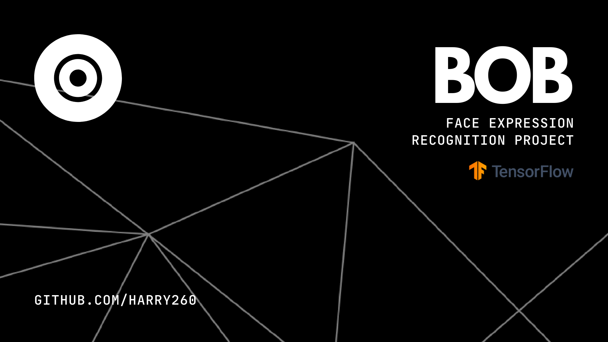

<h1 align="center">
    
   
    
   <a href="https://bobthebot.netlify.app/about">Bob the Bot!</a> 
   
</h1>

<h4 align="center">
    Bob is a bot powered by tesorflow.js that can use your device's camera to recognize your facial expression and speaks accordingly! This is a small project, actually made in One day! This uses Tensorflow and face-api.js.
</h4>

## Getting Started
To get started, click the [Launch](https://bobthebot.netlify.app/) button above! After it loads, you may see a popup asking you to set interval. This is the interval that the bot will check for your facial expression and precess sentances. If you want performance, you can set less `ms` but it will use high CUP, after setting it Enjoy!

This also have some awesome small features. This may ask you about saying about jokes, cat's picture, dog's picture, and also News! You can see the button when you are nuetral state. When you click that, It will pop it out!

# Proudly made with
  - [Tensorflow](https://www.tensorflow.org/)
  - [justadudewhohacks/face-api.js](https://github.com/justadudewhohacks/face-api.js/)
  - [Jquery](https://jquery.com/)
  - [just-doodle/news-apis](https://github.com/just-doodle/)
  - [Dog CEO API](https://dog.ceo/dog-api/)
  - [The Cat API](https://thecatapi.com/)
  - [Joke API](https://jokeapi.dev/)
  - [Useless Fact Api](https://uselessfacts.jsph.pl/)
  - [Bootstrap Icons](https://icons.getbootstrap.com/)

# ❤ Thanks
|   | [Agastya](https://github.com/notlemonhead) | Creating sentences for Bob! |
|---|---------|-----------------------------|

# 💪 Support
Support this product by ⭐Starring this repo

